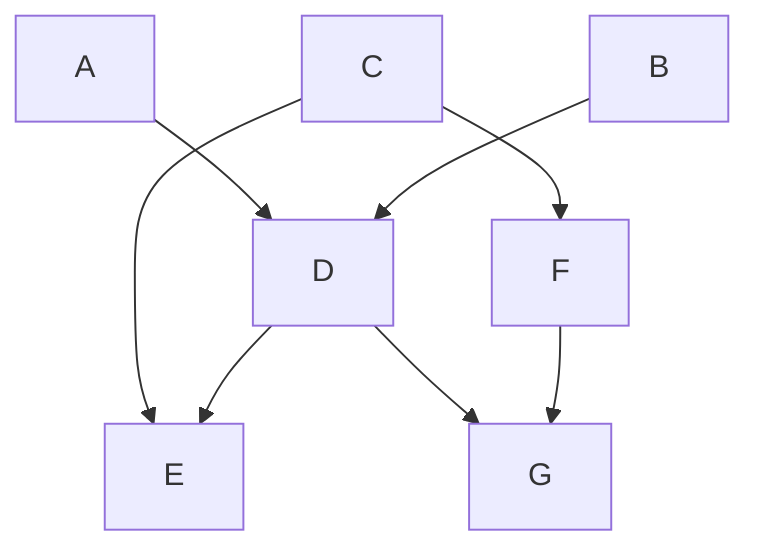

# Orchestration Tools Comparison

This repository compares the features, configurations, and implementations of four popular orchestration tools—**Argo Workflows**, **Apache Airflow**, **Tekton**, and **Kestra**—by implementing a common pipeline.

### Pipeline to Implement

The pipeline being implemented is defined as follows:

Each tool has its own folder in the repository, containing:
1. **An example implementation** of the pipeline.
2. **A detailed README** explaining how to install, configure, and run the tool for this use case.

---

## Tools Compared

### 1. Argo Workflows
Argo Workflows is a Kubernetes-native workflow orchestration tool designed to run parallel and distributed workloads.

**Features**:
- DAG-based orchestration.
- Scales seamlessly with Kubernetes.
- Supports dynamic workflows.

[Argo Workflows Documentation](https://argoproj.github.io/argo-workflows/)

### 2. Apache Airflow
Apache Airflow is a platform to programmatically author, schedule, and monitor workflows.

**Features**:
- Python-based DAG definitions.
- Rich UI for monitoring workflows.
- Suitable for both cloud and on-premise use cases.

[Apache Airflow Documentation](https://airflow.apache.org/)

### 3. Tekton
Tekton is a Kubernetes-native CI/CD system that can define and execute workflows as Kubernetes CRDs (Custom Resource Definitions).

**Features**:
- Kubernetes-native with strong CI/CD focus.
- Pipeline as code.
- High flexibility with task chaining.

[Tekton Documentation](https://tekton.dev/)

### 4. Kestra
Kestra is an orchestration tool for complex workflows, designed for distributed systems.

**Features**:
- Plugins for integration with diverse systems.
- Declarative workflow definitions.
- Scales efficiently for large pipelines.

[Kestra Documentation](https://kestra.io/)

---

## Contributing

Contributions to improve the implementations or add other orchestration tools are welcome! To contribute:
1. Fork this repository.
2. Create a new branch for your changes.
3. Submit a pull request with a description of your changes.

---

## License

This repository is licensed under the [Apache License 2.0](LICENSE).

---